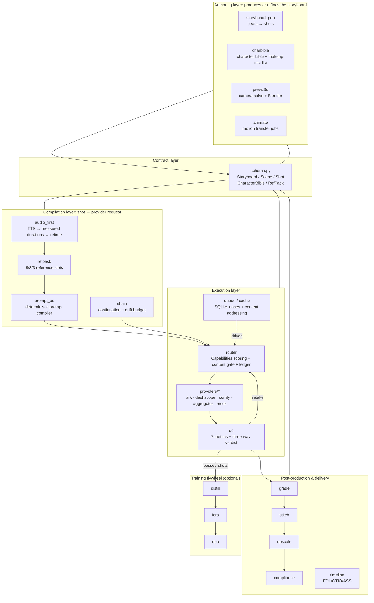
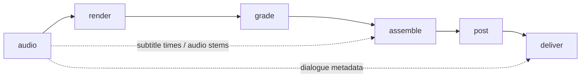
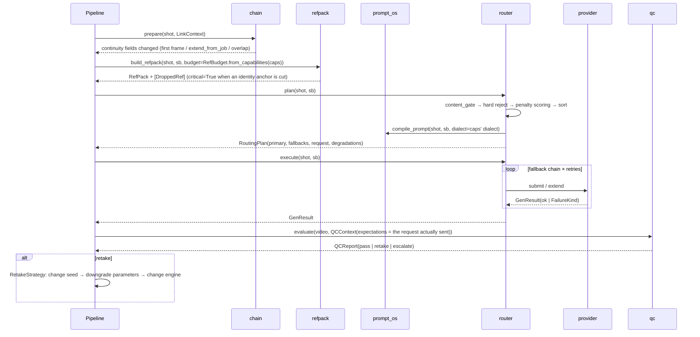

# Architecture

This document explains **how longfilm is put together, how data flows through it, and why it is designed this way**. For each module's public API, see [MODULES.md](MODULES.md). For the research conclusions and technology choices, see [PLAN.md](PLAN.md). For cloud deployment, see [../deploy/README.md](../deploy/README.md).

---

## 0. The problem, stated in one line

Any single engine today (Seedance 2.0: 4–15 s per shot; Seedance 2.5: about 30 s; open-source Wan 2.2: about 5 s) produces **one short shot**. A 2–8 minute film has 20–60 shots. Everything between those two numbers is done by this system:

- Which engine renders which shot, and what to do when that engine fails.
- How each shot inherits the previous shot's face, lighting and colour.
- How the dialogue lines up.
- How bad takes are caught and re-rendered.
- How the pieces are joined so the seams don't show.
- What provenance labels the finished film must carry.

So the architecture has one principle: **per-shot image quality comes from the engine; film length and consistency come from the system.** The system does not depend on any one engine. Swapping engines, adding engines and handling engine outages are all day-to-day operations, not special cases.

---

## 1. Layers at a glance



Three rules hold across the layers:

1. **Modules talk only through `schema.py`.** No module reaches into another module's internals. Wherever a module sits in the pipeline, its input and output is a `Storyboard` object (or its JSON form). Any stage can therefore be run alone, replaced, or picked up from disk.
2. **Decisions and execution are separate.** `router.plan()` only decides and returns a `RoutingPlan` snapshot: primary engine, fallback chain, compiled request, degradation records and cost estimate. `router.execute()` carries it out. The snapshot can be printed, reconciled and diffed without spending anything.
3. **Every cut, every degradation and every fallback leaves a record.** Nothing is dropped silently. That is the only way to answer "why did this face drift?"

---

## 2. Core contract: `schema.py`

```
Storyboard
├─ project / episode / logline / target_duration_s / style_bible / global_negative
├─ characters: [CharacterBible]
│    ├─ id / name / persona
│    ├─ is_fictional: Literal[True]                ← schema-enforced
│    ├─ age_statement (required)                   ← validator rejects empty values
│    ├─ appearance: Appearance ── to_prompt()
│    ├─ voice: VoiceProfile (tts_engine / tts_voice_id / timbre_ref_uri / speed / language)
│    ├─ portraits / turnaround: [ImageRef]         ← identity anchors; note="source=..." declares provenance
│    ├─ motion_refs: [VideoRef]
│    ├─ lora: LoRASpec | None (base_model / path / trigger_word / strength / dataset_hash)
│    └─ negative_prompt
├─ scenes: [Scene]  (id / title / synopsis / location / time_of_day / base_grade)
│    └─ shots: [Shot]
│         ├─ duration_s / shot_size / camera_move / lens_mm / aperture / fps
│         ├─ subject_ids / action / environment / lighting / mood / style / sfx
│         ├─ dialogue: [DialogueLine]  ← start_s / end_s are **seconds relative to the shot**
│         ├─ refs: RefPack (≤ 9 images / 3 videos / 3 audios, enforced by a validator)
│         ├─ continuity: Continuity (prev/next_shot_id, inherit_last_frame, emit_last_frame,
│         │                          extend_from_job, overlap_frames, screen_direction, match_on)
│         ├─ grade: Grade / transition_in / content_rating / engine_hint
│         ├─ seed / negative_prompt
│         └─ output fields: provider_used / job_id / render_uri / qc_score / takes
├─ audio: AudioPlan (dialogue / foley / music / ambience tracks, audio_first, loudness_lufs)
└─ delivery: DeliverySpec (resolution / upscale_to / fps / interpolate_to_fps / codec / crf /
                           aspect / burn_subtitles / ai_disclosure / c2pa)
```

Key design points:

- **`Shot.fingerprint()`** is a sha256 over the shot with its output fields removed. The queue's deduplication, the render cache's key and resume support all rely on it. Changing any semantic field changes the fingerprint. Writing back a render result does not.
- **`Storyboard.validate_continuity()`** checks the axis (180° rule), screen direction and first-frame / last-frame locks. The axis check tracks direction **per character**. Tracking only "the previous shot" produces false positives on shot/reverse-shot pairs.
- **`json_schema()`** exports a JSON Schema. When an LLM generates a storyboard, the schema serves as a structured-output constraint. `storyboard_gen.validate_and_repair()` then cleans up the result and reports everything it changed.

---

## 3. End-to-end data flow (`scripts/run_pipeline.py`)

The pipeline has six stages. Each one flushes its output and a JSON record to `<work>/pipeline_result.json` as soon as it finishes. Results are **merged by stage name**, so a later partial run does not overwrite the results of earlier stages.



| Stage | Input | Work | Output on disk |
|---|---|---|---|
| **audio** | Storyboard | TTS for each line → `ffprobe` measures exact duration → writes back `DialogueLine.start_s/end_s` → `retime_shots_to_audio` derives shot lengths from the dialogue (splits a shot at a breath if the line doesn't fit) → mixes one dialogue stem per shot into `RefPack.audios` | `audio/*.m4a`, retime report |
| **render** | Storyboard (retimed) | Per scene: `ChainPlanner.plan` → per shot: inject continuation → `build_refpack` → `router.plan/execute` → `QCGate.evaluate` → re-render when the verdict is retake | Per-shot mp4 + last frame, routing records, QC reports, ledger |
| **grade** | Passing shots | Per scene: `sample_stats` → `scene_reference` (**median**) → `match_to_reference` (Reinhard mean/std match) → `generate_lut` | Graded mp4s, `.cube` files, before/after drift figures |
| **assemble** | Graded shots + dialogue track | `timeline.build_timeline` → ASS subtitles → **batched tree assembly** (6 shots per batch → join the batches) → mix + two-pass loudnorm + burn subtitles | `episode.mp4`, `.ass`, EDL/OTIO |
| **post** | episode.mp4 | `Hardware.detect()` → `plan_postprocess` picks upscaling / frame-interpolation engines (every rejected option and its reason is recorded) → `PostPlan.run()` | `episode_post.mp4` |
| **deliver** | Finished film + Storyboard | `compliance_check` release gate → burn in visible disclosure label → write metadata (implicit label) → read the metadata back to verify → `ProvenanceManifest` | `deliver/episode_disclosed.mp4`, `manifest.json` |

### 3.1 Resume and stage dependencies

- `--resume`: recovers the video files already rendered on disk and reuses them. Only shots that are missing or failed are re-rendered.
- `--stages a,b`: runs only the named stages. **Some stages depend on in-memory state from earlier stages**, not just on files on disk. Subtitle times come from `DialogueLine.start_s`, which the audio stage writes back onto the Storyboard object. `STAGE_DEPS = {"assemble": ("audio",), "deliver": ("audio",)}` automatically inserts the audio stage when needed. Audio is TTS-cached, so the rerun takes about a second.
- `--limit N` / `--scale k`: shrinks the run for a quick check.

### 3.2 Why assembly is batched

A single ffmpeg `filter_complex` with 30 inputs, each needing xfade, normalization and resampling, was killed by the OOM killer (exit −9) on a machine with 4 GB of RAM. The fix is to build the film **tree-style**:

- Every 6 shots form one batch, producing an intermediate file.
- Intermediate batches **do not burn subtitles** (`burn_subtitles=False`). Subtitle times are relative to the whole film, and burning them into a batch would put them in the wrong place.
- Mixing, loudnorm and subtitle burn-in happen only in the final pass.

Peak memory grows with the batch size, not with the total number of shots.

---

## 4. Rendering a single shot



### 4.1 Reference slots (`refpack.py`)

The official API accepts at most 9 images, 3 videos and 3 audio clips. Other engines accept fewer. `RefBudget.from_capabilities(caps)` sets the budget from the target engine's declared capabilities.

- **Priority** (`ROLE_PRIORITY`): first frame 100 > identity 95 > last frame 85 > wardrobe 60 > environment 50 > style 45 > composition 35 > props 20 > lighting 10. Video slots follow motion > camera > previz > style. Audio slots follow dialogue > voice timbre > ambience > music. An unknown role gets 0, so it is cut first, but no exception is raised.
- **Multiple characters in one shot**: `allocate_identity_quota` splits the identity slots between the characters by quota. Filling slots in order would let the first character take every slot.
- **Picking views by shot size**: `preferred_views(shot_size)` returns the full fallback order. For example, a close-up prefers the frontal close-up and falls back to the three-quarter view.
- **Nothing is cut silently**: every cut becomes a `DroppedRef`. Cutting an identity anchor sets `critical=True`. The routing plan then switches to an engine with enough slots instead of submitting as usual.
- **`binding_directives`**: writes one sentence per slot saying what it controls and what it must not pass on. For example, "image 3 controls wardrobe only; do not take its face". This goes into the prompt.

### 4.2 Prompt compiler (`prompt_os.py`)

- **Deterministic**: the same input produces byte-identical output. Only then can the prompt fingerprint serve as a cache key, and only then are A/B experiments attributable (`diff_prompts`).
- **Layered assembly**: identity anchors (`charbible.consistency_anchors` picks the strongest anchor phrases first) → action → camera grammar (`camera_syntax`: shot size / camera move / focal length / aperture) → environment and lighting → audio directive → slot bindings.
- **Dialects**: `wan` (long English sentences), `seedance` (short sentences plus @image tags) and `generic`. The dialect follows the target engine; the storyboard does not change.
- **Negative prompts**: grouped term bank (`NEGATIVE_BANK`) + film-wide + character + shot level. Duplicates are removed and order is fixed.

### 4.3 Routing (`router.py`): read only Capabilities, never check names

Engines share one interface: `VideoProvider.submit / poll / extend / cancel / health / estimate_cost`. Each engine declares its abilities in a frozen dataclass, `Capabilities`:

- Duration range and steps, resolutions, fps.
- Reference slot limits.
- Whether it supports first/last-frame locks, extend, job continuation, native audio, LoRA, seeds and negative prompts.
- Whether it is moderated, its concurrency, $ per second, typical latency and quality tier (1–5).

**The router reads only this declaration. There is no `if provider == "..."` anywhere in the code.** Adding a vendor means writing one provider and registering it in `REGISTRY`. The queue, jobs and pipeline stay unchanged.

Decisions happen in three steps:

1. **Content gate** (`content_gate`), a hard threshold. If it fails, the shot does not even get scored.
   - The rating must not be `blocked`.
   - Every character on screen must be found in the character bible and must carry an adult statement.
   - The rating decides which engine kinds are allowed:
     - G / PG-13 may use any kind.
     - R ratings are sent **only** to self-hosted engines, never to the official or aggregator channels (aggregators still run on official channels underneath). The system does not probe any vendor's moderation.
2. **Hard reject** (`_hard_reject`): the engine kind doesn't match `engine_hint`, a hero shot needs a higher quality tier, the provider's quota ($ / call count) is used up, or concurrency is full.
3. **Penalty scoring** (`_penalties`): capability gaps become point deductions. The deductions are:

   | Capability gap | Deduction |
   |---|---|
   | Duration clamped | Up to 0.6, scaled by the gap |
   | No first-frame lock | 0.30 |
   | No job continuation / official extend | 0.25 |
   | No last-frame lock | 0.20 |
   | Cannot load the character LoRA | 0.20 |
   | No native dialogue audio | 0.15 |
   | No camera-motion parameters | 0.10 |
   | Highest resolution below delivery | 0.10 |
   | No seed | 0.05 |
   | No negative prompt | 0.05 |
   | Reference slots it cannot take | 0.35 × proportion lost |

   The weights then combine with a `QualityBias` (`quality` for hero shots, `cost` for volume production, `speed` for previz rough cuts) for the final sort. Every deduction comes with a plain-language reason in `RoutingPlan.explain()`.

Execution (`execute`) walks the fallback chain. Each failure kind (`FailureKind`) has one fixed handling:

| FailureKind | Handling |
|---|---|
| RATE_LIMIT / TIMEOUT / SERVER | Retry with exponential backoff on the same provider (`retryable`) |
| QUOTA / AUTH | Move straight to the next provider |
| MODERATION | **No retry at the same provider and no rewriting the prompt to get past review.** Moves to the next engine in the fallback chain. The chain has already been filtered by this system's content gate. |
| BAD_REQUEST | Raise an error and send the job back for correction. Retrying only burns quota. |

`CostLedger` records **failed calls too**: a rejected job still spends quota and time. `ensure_affordable` enforces the per-episode budget, and `BudgetExceeded` stops execution before the money is spent.

### 4.4 Continuation chain and drift budget (`chain.py`)

When a long take is split into several atomic segments, the next segment must "grow" from the previous one. There are four strategies, sorted by drift from smallest to largest:

| Strategy | Condition | Principle | Base drift |
|---|---|---|---|
| `OfficialExtendChain` | Same provider and `supports_extend` | The same latent lineage keeps extending | 0.18 |
| `JobContinueChain` | `supports_job_continue` | Continue from the previous job_id | 0.20 |
| `OverlapChain` | Both segments can overlap | The next segment starts drawing from the previous segment's last N frames (default 6); `stitch.overlap_blend` blends them | 0.26 |
| `LastFrameChain` | Any engine that supports a first-frame lock | The previous segment's last frame becomes the next segment's first frame; the only method that works across providers | 0.30 |

**`DriftBudget`** makes "how many segments can be chained" explicit:

- Per-segment cost = base × (1 + 0.02 × segment seconds) × (1.25 without a LoRA) × (0.8 when identity anchors are fed).
- The budget accumulates, and **a re-anchor is forced before the threshold (1.0) is exceeded**. That segment goes back to the character-bible anchors and no longer inherits the previous segment's last frame.
- The threshold is calibrated so that the steadiest strategy can chain exactly 4 segments. This is the pipeline's initial value, not a conclusion from any paper. The docstring explains how to recalibrate.

`pick_tail_frame` checks the sharpness of the last frame (Laplacian variance). When the final frame is blurry, it steps back to an earlier frame. Encoders often blur the last frame, and using it as the next first frame would pass the blur along the chain.

### 4.5 Quality control and retakes (`qc.py`, `queue.RetakeStrategy`)

`QCGate.default()` uses seven metrics that run on CPU:

| Metric | Blocking | Detects |
|---|---|---|
| FreezeDetect | ✔ | Generation stalls halfway and the image freezes |
| BlackDetect | ✔ | Black frames (the cheapest sign of a failed generation) |
| DurationFpsConformance | ✔ | Duration / fps / resolution don't match the request |
| TemporalFlicker | | Sudden brightness or chroma jumps between frames |
| ColorDrift | | Colour drift from start to end within a segment |
| MotionSanity | | Motion amplitude too static or too violent |
| SeamCheck | | Jumps at the seams |

**Blocking items are cases where "this is not what was asked for at all", so they veto on their own. Degree-type items feed a weighted score.**

Optional plugin metrics (`IdentityDrift`, `AestheticScore`, `LipSyncScore`) join automatically when their dependencies are available. When they're not, they are not included at all, so no pile of SKIP noise.

The verdict has three outcomes:

- **pass** goes to post-production.
- **retake** re-renders the shot. `RetakeStrategy` goes from cheap to expensive: change the seed, then downgrade parameters (tone down the camera move / shorten the duration / add artifact negatives), then change engine.
- **escalate** is handed to a person.

The seed comes from `derived_seed(fingerprint, take)` and is deterministic, so after a resume the Nth retake computes the same seed.

**QC expectations come from the request actually sent**, not from the storyboard's original values. The router clamps the duration to the engine's steps; comparing against the original shot would wrongly flag a spec mismatch.

### 4.6 Audio first (`audio_first.py`)

The order is fixed: **nail down the dialogue track first, then derive the picture from it.** Doing it the other way (picture first, then fitting dialogue) always ends with either dialogue that doesn't fit or dead air.

- Backends: `EdgeTTSBackend` (online, no key needed), `HttpTTSBackend` (self-hosted IndexTTS-2 / CosyVoice2 / GPT-SoVITS), and `SilentTTSBackend` (offline placeholder that keeps the whole pipeline runnable). `pick_backend` picks one that actually works in the current environment.
- **Durations are measured, never estimated.** The audio is decoded to s16le and its byte count is converted to exact seconds. An estimate fed into the timeline slowly drifts out of sync.
- **The time model**: `DialogueCue` stores both `shot_offset_s` (relative to the shot) and `abs_start_s` (absolute). The storyboard stores only the relative time. Retiming, shot splits and reordering constantly change absolute times, but they never change where a line sits within its own shot. `timeline` computes absolute values on the fly.
- Each shot gets one dialogue stem, hung on `RefPack.audios` (role=dialogue). Engines with native audio use it to drive lip sync.

### 4.7 Grading, assembly and post-processing

- **grade**: each scene's colour reference is the **median** of per-item statistics across the scene's shots. The mean would be dragged off by one broken shot. Each shot is matched to the reference with the Reinhard mean/std method, compiled into a per-channel affine transform, and can be baked into a `.cube` 3D LUT for DaVinci/OBS. In the measured run, cross-shot drift fell from 44.5 to 7.9.
- **stitch**:
  - `FFmpeg` is the single exit point for every ffmpeg call.
  - A hard cut with identical parameters uses the concat demuxer + `-c copy` with zero re-encoding.
  - Transitions use an xfade chain, with `clamp_transition_s` as the **only** clamping rule for transition length.
  - `overlap_blend` blends overlapping frames.
  - `assemble_episode` finishes picture, mixing, two-pass loudnorm and subtitle burn-in in one `filter_complex`.
- **upscale**:
  - `Hardware.detect()` returns a hardware snapshot.
  - `plan_postprocess` chooses among FFmpeg (CPU baseline) / Real-ESRGAN / SeedVR2 / Comfy remote for upscaling and minterpolate / RIFE for frame interpolation, based on the delivery spec and the hardware.
  - Every rejected option and its reason goes into `PostPlan.warnings`.
  - `chunked_process` splits long videos into segments, with the invariant Σwindows − (n−1)×overlap = total duration.
- **timeline**: builds the multitrack timeline and exports:
  - CMX3600 EDL, OTIO JSON and ASS subtitles (with CJK line breaking via `wrap_cjk`);
  - an ffmpeg concat list;
  - a sync report (tolerance ≈ one frame).

  The finished film can go into DaVinci Resolve for manual finishing.

### 4.8 Compliance and provenance (`compliance.py`)

- **Visible label**: burned in with libass. The build's ffmpeg has no drawtext, and libass is better at CJK line breaks and outlines anyway. By default it stays on screen for the whole film, because clips get re-edited and re-uploaded. The label height is 5% of the frame height. This is an engineering lower bound, marked with a TODO to calibrate once the full text of the national standard is available.
- **Implicit label**: container metadata. Once written, it **must be read back** (`read_metadata`) before it counts as written.
- **Provenance manifest** (`ProvenanceManifest`): for each shot it records the engine, model version, seed, prompt fingerprint, and the sha256 and source type (`source=ai_generated|licensed|...`) of every reference image. The test for inclusion is whether a field is needed to re-render that shot. `c2pa_stub` produces an unsigned C2PA manifest definition.
- **Release gate** (`compliance_check`): characters are fictional, every reference image carries a source type, and ratings are legal. If any check fails, the film is not released.

### 4.9 Fonts (`_fonts.py`)

Subtitles, visible labels and watermarks all need a CJK font. The repo ships no font files, since the licenses don't allow redistribution. The lookup order is:

1. `LONGFILM_FONT`
2. `assets/fonts/`
3. System Noto CJK / WenQuanYi / Microsoft YaHei under WSL / macOS PingFang

The family name is read from the font file itself. libass matches fonts by family name, and a wrong name silently turns every character into boxes.

---

## 5. Reliability

| Mechanism | Where | What it solves |
|---|---|---|
| SQLite job queue + leases | `queue.JobQueue` | Every state lives in SQLite, so the process can die at any time. `claim` sets a lease; a lease that expires without a `heartbeat` is reclaimed by `reclaim_expired`, so no job stays stuck forever |
| Idempotent enqueue | `JobQueue.job_key` = shot fingerprint | Enqueuing the same shot twice does not create a second job |
| Content-addressed cache | `cache.ArtifactStore` + `PromptCache` | Prompt + parameter fingerprint → artifact sha256. **The cache is checked again before execution**, so a result another worker just produced is not billed twice. `gc` uses every URI in the storyboard as its reference roots |
| Per-thread connections | `cache._ThreadLocalDB` | `close()` closes only the current thread's connection. Closing one across threads makes SQLite raise |
| Resume by stage | `run_pipeline._flush/_resume` | Each stage is written to disk as soon as it finishes, results are merged by stage name, and dependencies are inserted automatically |
| Child dies with parent | `_proc.PREEXEC` (`prctl(PR_SET_PDEATHSIG, SIGKILL)`) | Guaranteed by the kernel: **even when the parent is SIGKILLed, the child ffmpeg dies too**. Before this, an orphaned ffmpeg once ran for 18 hours. Every ffmpeg subprocess starts through `_proc.run/popen` |
| Memory limits | Batched assembly, streaming hashes, streaming downloads | Designed around 3–4 GB of RAM. Files are never read into memory whole |
| Key redaction | `providers/_http.redact` | Every string passes through it before it reaches a log |

---

## 6. Provider matrix

| Provider | kind | Moderated | Duration | Refs (images/videos/audio) | extend | Native audio | LoRA | Notes |
|---|---|---|---|---|---|---|---|---|
| `ark_seedance` (Seedance 2.0 `doubao-seedance-2-0-260128`, plus 1.0 pro/lite) | official | ✔ | 4–15 s (2.0) | 9 / 1 / 1 (2.0; conservative declaration) | ✔ (via reference_video) | ✔ | ✘ | Quality ceiling; no fine-tuning. Seedance 2.5 (about 30 s) is not yet in the model catalog; see PLAN.md §0 |
| `dashscope_wan` (Wanxiang 2.2 / 2.5 / 2.6 / 2.7, i2v, kf2v) | official | ✔ | Model-dependent | Model-dependent | Model-dependent | Model-dependent | ✔ official training | Trained weights cannot be downloaded |
| `comfy_local` (self-hosted Wan 2.2) | open | ✘ | Frame count 4k+1 | 2 / 0 / 0 (template's first and last frame) | ✘ (uses last-frame chain) | ✘ | ✔ | Main self-hosted engine; workflow template + semantic binding table |
| `aggregator` (fal / Replicate) | aggregator | ✔ | Model-dependent | Model-dependent | — | — | Some fal models ✔ | Third fallback |
| `mock` | open | ✘ | Configurable | 9 / 3 / 3 | ✔ | Configurable | ✔ | Offline CI/demo base; renders real mp4s, deterministic fault injection |

The exact numbers are in each provider's `Capabilities` declaration. The table only gives the outline.

---

## 7. Training flywheel (optional)

```
Shots that pass QC in production ──harvest──▶ DistillDataset (per-provider licence check: LicenseFlag)
                                      │
                                      ├─to_training_set──▶ musubi-tuner / diffusion-pipe training directory (target_frames = 4k+1)
                                      │                      └─lora.LoRATrainingJob ─▶ config / command line / cost range / resume from checkpoint
                                      └─build_pairs_from_qc / from_human──▶ PreferenceDataset ─▶ DPO
FlywheelMonitor: tracks effective modes (exp of entropy) for shot size / camera move / diversity, and raises an alert on collapse
audit_static_bias: checks whether auto-labelling systematically prefers static footage
```

- **Licence first**: `license_of(provider)` treats unregistered providers as unknown and never lets them through by default. Vendor terms are recorded with `source` and `checked_on`.
- **Resume from checkpoint**: `plan_resume` parses the `*-state` directories **by progress, not mtime**, and computes the remaining epochs. musubi's `--resume` would otherwise rerun the full `max_train_epochs`. Together with `deploy/train_lora_pod.sh`, which syncs state every 600 s, this makes spot and preemptible instances usable.
- **Known limit**: learning camera motion with a LoRA doesn't work (see PLAN.md §1.1). Combining a self-trained LoRA with few-step acceleration also loses much of the LoRA's effect (§1.2).

---

## 8. Deployment topology

```
            ┌──────────────── Control plane (any CPU machine, including WSL) ──────────────┐
            │  run_pipeline / queue / router / qc / grade / stitch / compliance           │
            └───────┬──────────────────────┬─────────────────────────┬─────────────────────┘
                    │ HTTPS                │ HTTP / WebSocket        │ HTTPS
          ┌─────────▼─────────┐  ┌─────────▼──────────┐   ┌─────────▼─────────┐
          │ Official API       │  │ Cloud GPU pod       │   │ Aggregator        │
          │ Ark / Bailian      │  │ ComfyUI + Wan 2.2   │   │ fal / Replicate   │
          └───────────────────┘  │ (bootstrap_gpu.sh)  │   └───────────────────┘
                                 │ LoRA training       │
                                 │ (train_lora_pod.sh) │
                                 └────────────────────┘
          RunPod Serverless: runpod_serverless_handler.py (outputs are returned via S3)
```

- The control plane and the GPU are **decoupled**. The control plane needs no GPU. `COMFY_URL` points to whichever pod is currently rented, so the GPU can be shut down whenever it isn't needed.
- `deploy/bootstrap_gpu.sh` is a one-shot pod setup script:
  - health check (driver / VRAM / disk);
  - downloads by profile (`models.yaml`: smoke / production / training);
  - install ComfyUI and nodes;
  - smoke test.

  Each failure has its own exit code.
- `deploy/cost_calculator.py` + `prices.yaml`: works out what to spend before any machine is started. It covers:
  - full API vs self-hosted;
  - on-demand vs spot;
  - the Paperspace subscription tier.

  Prices were checked on 2026-09-20.

---

## 9. Extension points

| To add | Do this | Leave unchanged |
|---|---|---|
| A new video engine | Subclass `VideoProvider`, declare `Capabilities`, and `REGISTRY.register(...)`; map vendor error codes to `FailureKind` | router / queue / pipeline |
| A new prompt dialect | Add a `PromptDialect` in `prompt_os`, and have the provider declare which dialect it uses | The storyboard |
| A new QC metric | Subclass `QCMetric`; for heavy dependencies subclass `OptionalMetric` + `register_plugin` | The gate framework |
| A new continuation strategy | Subclass `ChainStrategy` and implement `supported_by / applicable / prepare`; give it a base drift | DriftBudget |
| A new TTS | Subclass `TTSBackend`, or use `HttpTTSBackend` with a configurable `HttpTTSSpec` | Timeline / retime |
| A new upscaling engine | Subclass `Upscaler` and declare an `EngineSpec` (throughput / VRAM / licence) | The PostPlan decision logic |

---

## 10. Boundaries (hard limits written into the code)

- **Fictional adult characters only.** Four layers enforce this:
  - `CharacterBible.is_fictional: Literal[True]`
  - `age_statement` is required
  - `content_gate` rejects shots that fail it
  - `compliance_check` blocks release
- **No sexually explicit content.** `ContentRating` has no explicit tier. `blocked` means refused.
- **No moderation evasion.** Content is never sent to a channel whose policy forbids it. A moderation rejection is never answered by rewriting the prompt and trying again at the same vendor. Vendor moderation happens inside the vendor's inference pipeline, and nothing downstream can bypass it.
- **No real-person likeness.** Every reference image must declare its source type. The repo ships no real-person images.
- **Provenance labels are on by default**, and the visible label stays on screen for the whole film by default.

---

## 11. Known limits

- The local demo shots are synthesized by the mock engine. **They demonstrate scheduling, not image quality.** For real image quality, connect a real engine.
- `DISCLOSURE_HEIGHT_RATIO` and the implicit-label field names must be calibrated once the full text of GB 45438-2025 is available.
- The drift budget threshold, the QC metric thresholds and the retake strategy were calibrated on the mock engine. After switching to a real engine, they need to be recalibrated on real footage.
- Engine information (models, prices, capabilities) is as checked on 2026-09-20. `docs/research_corrections.md` records which claims were overturned in fact-checking.
